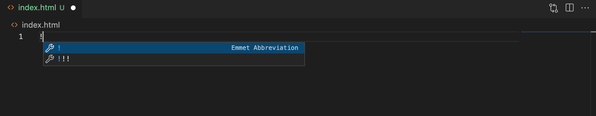
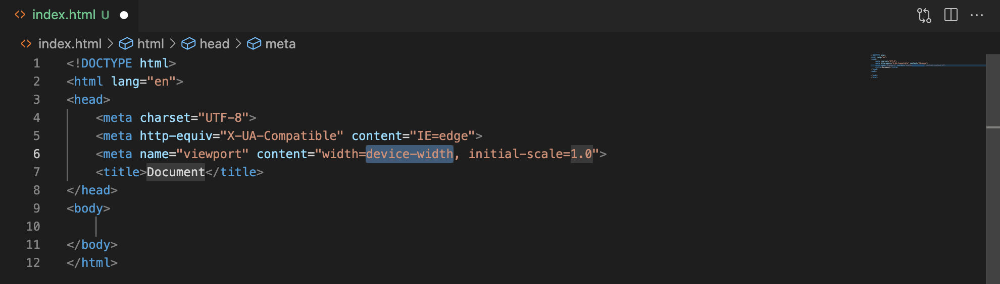

# PRIMERA WEB

## Creem contingut a l'Html





## Carregar Javascript a l'Html

Dins del ```<head> </head>``` afegim ```<script></script>```

> De vegades també el podem trobar dins del body però just abans de tancar el tag.

Importem arxius .js:

```html
<script src="index.js"></script>
```

I dins l'arxiu **index.js** és on afegirem el codi javascript:

```js
console.log('hello world')
```

En línea directament al html: 
```html
<script>
    console.log('hello world')
</script>
```
