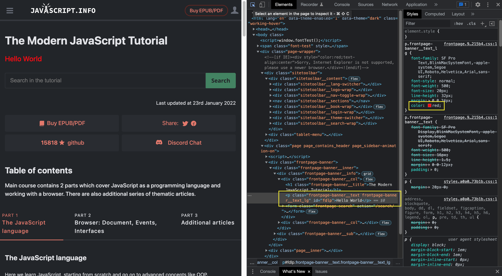
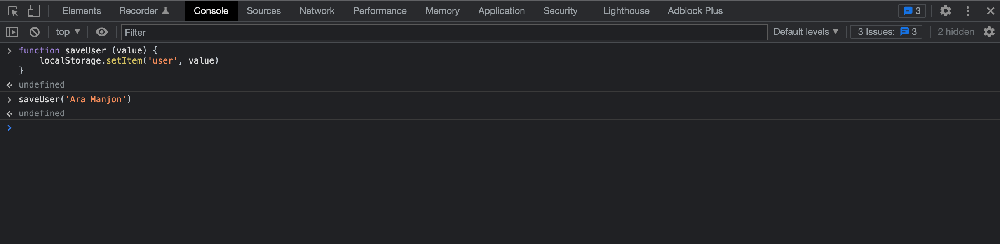
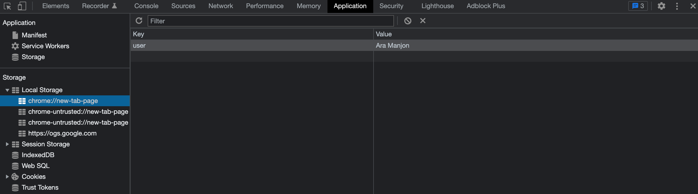
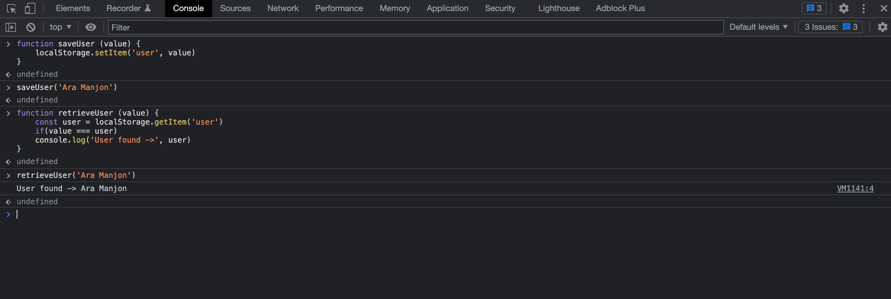

# FONAMENTS DE LA PROGRAMACIÓ AMB JAVASCRIPT

5 consells per a un/a futur/a programador/a:

**- Ordenat en programació.**

**- Tot és possible d'aconseguir**. Concepte baby steps. 

**- Tothom pot ser programador/a**

**- Networking**

**- Google**

## **Javascript**
### 💻 El llenguatge de la web.

**1. JavaScript** és l'únic llenguatge de programació que funciona en els **navegadors de forma nativa** (llenguatge interpretat sense necessitat de compilació). Per tant, s'utilitza com complement de HTML i CSS per crear pàgines webs.

Notes:
>**Navegador:** És un programa que permet veure la informació que conté una pàgina web. (GoogleChrome, Firefox, Mozila, 
Opera, Safari, Internet Explorer...)

>**Compilar:** La paraula compilar vol dir traduir un codi de programació a codi executable per la màquina.

És per aquesta raó que es coneix Javascript com un llenguatge del costat del client. **Frontend**

Exemple:



Però també és un llenguatge que es fa servir per escriure el programa que s'executa en el costat del servidor. **Backend**

Exemple:





Notes:
>**Costat del servidor:** El servidor és el programa on és connecta la web (Front-end) per guardar, modificar, demanar i eliminar informació a la base de dades.

**2. JavaScript és un llenguatge de tipat dinàmic**. Això vol dir que una variable pot tenir valors de diferents tipus. 

Exemple:
```
let variable = 5; /* la variable és de tipus number */
variable = '5'; /* la variable és de tipus string */
```

**3. JavaScript és un llenguatge de tipat dèbil o no tipat**. Vol dir que és un llenguatge amb el qual la declaració de variables no és requereix especificar quin tipus de dada tindrà.

Exemple:
```
let variableExempleString = 'I am a string'; /* la variable és de tipus string */
let variablexempleBoolean = true; /* la variable és de tipus boolean */
```

**4. JavaScript és un llenguatge d'alt nivell**. És a dir, la seva sintaxi és molt similar a la del llenguatge de les persones.


**5. JavaScript és un llenguatge multiparadigma**. A diferència d'altres llenguatges, javascirpt permet programar utilitzant la combinació de diferents paradigmes.

- Programació declarativa -> escriure el que vols fer sense dir com.
- Programació funcional -> sub-paradigme de programació declarativa. 
- Programació imperativa -> escriure codi dient com vols que ho faci.
- Programació orientada a objectes (OOP) -> fa servirr objectes per modelar elements que volem construir. En javascript tot són objectes.

Notes:
>**Paradigma de la programació:** és la forma de veure i crear codi en la programació. Cada paradigma té les seves regles.

### 📚 Recursos

[Curs Javascript](https://javascript.info/).

[CheatSheets](https://overapi.com/javascript) de javascript.

Diferents enllaços amb informació sobre Javascript [aquí](https://fullstackopen.com/en/part1/java_script#java-script-materials).

Vídeo [25 coses que no sabies sobre Javascript](https://www.youtube.com/watch?v=swfvSLCXxHE).

Més avançat -> [Notes sobre el llibre JavaScript: The Good Parts](https://github.com/dwyl/Javascript-the-Good-Parts-notes#chapter1)

Més avançat -> [Llibre bones pràctiques Javascript](https://cleanjavascript.es/).


## **Terminal**
Una eina d'ús diari com a programador que és la **Terminal**. 
Per moure'ns entre carpetes, executar scripts...

- Mac -> [ITerm2](https://iterm2.com/index.html)
- Windows -> Windows Terminal [Hyper](https://hyper.is/)

Notes:
> Sistemes operatius per instal·lar en qualsevol ordinador [Linux](https://www.redhat.com/es/topics/linux/what-is-linux). Dos distribucions de Linux més populars són [Ubuntu i Linux Mint](https://www.locurainformaticadigital.com/2021/02/16/linux-mint-vs-ubuntu/).

### 📚 Recursos

Per fer la terminal més amigable [ohmyzsh](https://ohmyz.sh/)

[Mac commands cheatsheet](https://www.makeuseof.com/tag/mac-terminal-commands-cheat-sheet/)

[Windows commands cheatsheet](http://www.cs.columbia.edu/~sedwards/classes/2015/1102-fall/Command%20Prompt%20Cheatsheet.pdf)

Vídeo on veure una explicació de l'origen de la [Terminal](https://www.youtube.com/watch?v=mKSOwHBkYHY) 

## **VisualStudio Code**
Instal·lar un editor de codi font [Visual Studio Code](https://code.visualstudio.com/download)

## **Markdown**

És un convertor de text pla a HTML.

És un llenguatge que té com a objectiu mantenir una alta llegibilitat.

### 📚 Recursos
Com prendre apunts amb [Markdown](https://www.markdownguide.org/basic-syntax/). 

Notes:
> Exemple de com crear un arxiu Markdown. README.md

## **Altres eines**

[Katas Javascript](https://www.codewars.com/?language=javascript)

[Mecanografia](https://www.typingclub.com/)

Llistes [Todo](https://todoist.com/app/today)

[Trello](https://trello.com/)

[Bulletjournal](https://bulletjournal.com/blogs/bulletjournalist)
