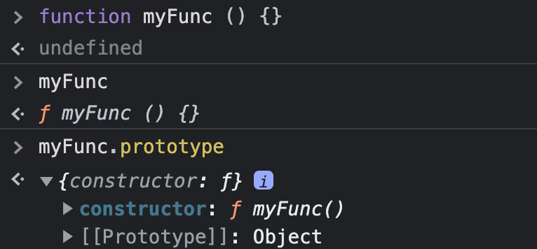

# FONAMENTS DE LA PROGRAMACIÓ AMB JAVASCRIPT

##  **Programació orientada a objectes OOP**

És un paradigma de la programació on els objectes representen les entitats, contenen dades i codi.

Javascript és un llenguatge multiparadigma, això vol dir que pot utilitzar la combinació de diferents paradigmes.

### **Objectes: dades i codi**

Les dades que estan dins d'una funció es coneixen com a propietats. 

Les funcions que estan dins d'una propietat dins d'un objecte, és un mètode.

Si un objecte té un o més mètodes, diem que té **comportament**.

```
const persona = { name: 'My Name', sayHello: function(){ console.log('hola') }}

persona.sayHello() // hola

//sayHello és un mètode de persona
```

```
console.log('Hello World!')

//log és un mètode de console
```

### **A Javascript tot són objectes**

Molts cops es descriu Javascript com un llenguatge orientat a objectes basat en prototips. És a través de prototips que s'executen els mecanismes d'herència. Els objectes poden tenir un objecte prototip, que actua com objecte plantilla del qual hereta mètodes i propietats.



#### **Funcions: ciutadans de primera classe**

typeof instance === 'function'
instance instanceof Object

Si un llenguatge de programació té la capacitat de tractar les funcions com a valors, passar-les com arguments i retornar la funció d'una altra funció, es diu que aquest llenguatge té funcions de primera classe.

Les funcions a Javascript tenen aquestes capacitats:

Exemple: 
```
const greet = function() {
    console.log("Welcome!")
}
greet() "Welcome"
```

```
function teacher(){
    return "Teacher"
}
  
function greet(user){
    console.log("Welcome", user())   
}
  
// Prints "Welcome Teacher"
const message = greet(teacher) // "Welcome Teacher"
```

```
const greet = function(){
    return function(){
        return "Welcome!"
    }
}
const message = greet()
console.log(message) //"Welcome"
```

Notes:
> 🚨 Les funcions que retornen una altra funció es coneixen com a funcions d'ordre superior (High Order Functions).

### **OOP**

En la programació orientada a objectes es combinen un grup de valors i funcions dins d'una unitat. A aquesta unitat se la coneix com a objecte. 

Exemple implementació procedimental:
```
let anualSalary = 30000
let months = 12

function getSalary (anualSalary, months) {
    return anualSalary / months
}
```

Exemple implementació OOP:
```
let employee = {
    anualSalary: 30000,
    months: 12,
    getSalary: function getSalary () {
        return this.anualSalary / this.months
    }
}
```

#### **This**

La paraula reservada ```this``` a Javascript ens serveix per fer referència a l'objecte que conté el mètode que l'invoca.

```
function myFunc () {
    console.log(this)
}
myFunc() // Window
```

```
function myFunc () {
    return {
        x : 100,
        y : 200,
        calculate: function () {
            console.log(this.x / this.y)
        }
    }
}
myFunc().calculate() // 0.5
```

#### **Funcions de fàbrica o de constructor**

Imaginem que tenim un objecte amb valors i mètodes, i volem tenir 3 d'aquests objectes, si haguéssim de variar un dels mètodes o propietats, hauríem d'anar objecte per objecte a fer les modificacions.


```
const circle = {
    radius: 1,
    location: {
        x: 1,
        y: 1,
    },
    draw: function () {
        console.log('draw')
    }
}
const circle2 = {
    radius: 1,
    location: {
        x: 1,
        y: 1,
    },
    draw: function () {
        console.log('draw')
    }
}
```

🚨 Notes
> Els objectes literals no són una bona idea si l'objecte té més d'un mètode.

Això ho podem solucionar amb una **funció de fàbrica**.

```
function createCercle (radius) {
    return {
        radius, // radius: radius
         draw: function () {
            console.log('draw')
    }
}

const circle = createCercle(1)
```

Hi ha una altra manera de crear un objecte i és amb una **funció constructora**
La convenció de nom en aquest tipus de funció és en Pascal Case.

```
function Cercle (radius) {
    this.radius = radius
    this.draw = function () {
        console.log('draw')
    }
}
const circle2 = new Cercle(1)
```

#### **new**

> La paraula reservada ```new``` el que fa és crear un nou objecte vuit, amb una referència pròpia, atribuirà el contingut de la funció.

> Si no utilitzem la paraula ```new``` el ```this``` de dins de la funció apuntarà a l'objecte que  conté aquesta funció. En un navegador és l'obejcte Window.

> Una l'us de ```new``` en una funció constructora retornarà aquest nou objecte amb el contingut.

#### **Funcions constructores del llenguatge Javascript**
A Javascript tenim funcions constructores incorporades en el llenguatge. 

```
function Cercle (radius) {
    this.radius = radius
    this.draw = function () {
        console.log('draw')
    }
}
const circle2 = new Cercle(1)
circle2.contructor 
// ƒ Cercle {radius: 1, draw: ƒ}

```

```
let obj = {}
obj.contructor 
// ƒ Object() { [native code] }
// Podriem utilitzar new Object() per crear un objecte

let str = ''
str.constructor 
// ƒ String() { [native code] }
// Podriem utilitzar new String() per crear un objecte
```

#### **Constructors**

A partir d'ES6 podem crear objectes a partir de la paraula clau ```class```, tal com es fa en altres llenguatges orientats a objectes.

```
class Person {
    constructor(name){
        this.name = name
    }

    greet() {
        console.log(`Hello, I am ${this.name}`)
    }
}

const persona = new Person('Pepito')
```

#### **Getters i Setters**
De vegades és necessari tenir variables i mètodes que quedin encapsulats en l'objecte, és a dir, els quals no es pugui operar amb ells des de fora del mateix objecte, evitant així modificar els valors des de fora de l'objecte.

Per això podem transformar aquests valors en privats.

```
class Person {
    #name
    constructor(name){
        this.#name = name
    }

    greet() {
        console.log(`Hello, I am ${this.#name}`)
    }

    get() {
        return this.#name
    }

    set(name) {
        this.#name = name
    }

    toString () {return `${this.#name}`}
}

const persona = new Person('Pepito')
persona.toString() // 'Pepito'
persona.name //undefined
```

### 📚 Recursos
[Programació funcional](https://softwarecrafters.io/javascript/introduccion-programacion-funcional-javascript)