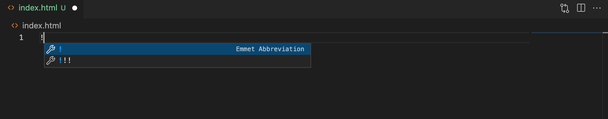
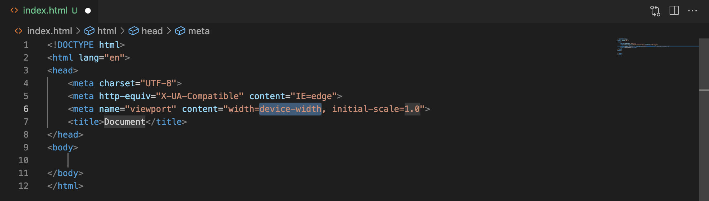

# FONAMENTS DE LA PROGRAMACIÓ AMB JAVASCRIPT

## **La nostra primera web**

### 📟 Des de la Terminal

1- Ens movem a la carpeta on volem crear la nostra primera web.

Commands:

> **ls** (Apple: ensenya el llistat d'arxius i subdirectoris del directori)

> **dir** (Windows: ensenya el llistat d'arxius i subdirectoris del directori)

> **cd** *path-carpeta* (Apple & Windows: per moure'ns entre carpetes)

> **mkdir** *nom-carpeta* (Apple & Windows: crear una carpeta)

2- Creem un arxiu .html

> **touch** *nom-arxiu* (Apple: per crear un arxiu)

> **type nul >** *nom-arxiu* (Windows: per crear un arxiu)

Notes:

> **rm** *nom-arxiu* (Apple & Windows: esborrar arxius)
> **rm -rf** *nom-carpeta* (Apple & Windows: esborrar carpetas)

> **fsutil file createnew** *nom-arxiu* **0** (Windows: una altre opció per crear un arxiu)

> **code .** ens obrirà el vsc des de la carpeta on estem situats

### Creem contingut a l'Html





### Carregar Javascript a l'Html

Dins del ```<head>``` afegim ```<script></script>```

> De vegades també el podem trobar dins del body però just abans de tancar el tag.

En linea: 
```
<script>
    console.log('hello world')
</scrript>
```
Importem arxius .js:
```
<script src="script.js"></scrript>
```
I dins l'arxiu scrpit.js és on afegirem el codi javascript ```console.log('hello world')```

Notes: 
> Instal·lar Livee Server com a extensió en el VSCode