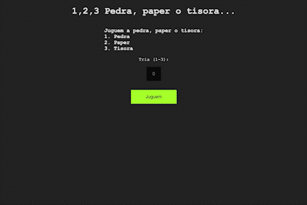

# Stone, Paper, Scissors



Write a program that allows you to play stone, paper, or scissors with your computer.

Visit the project [here](https://aramanjon.github.io/).

📍 HOW TO INSTALL:

```
git clone git@github.com:AraManjon/AraManjon.github.io.git

cd AraManjon.github.io

open index.html in browser
```

🔖 REQUIREMENTS:

To do this, the computer must generate a random number between 1 and 3 representing stone, paper or scissors respectively, and the user must answer in turn with a number between 1 and 3 after show the following screen:

Let's play stone, paper or scissors:

1. Stone

2. Paper

3. Scissors

Third (1-3):


🔍 CONSTRAINS:

1.- If the user indicates a number other than the requested number, the following message should appear:

“Entenc que no vols jugar. Adéu"

2.- Otherwise, indicate the winner as follows:

Jo xxx i tu xxx. He guanyat! o Has guanyat!!

as the case may be.

Example:

```
“Jo paper i tu tisora. Has guanyat!”
```

🎲 RULES:

Paper wins the stone because it wraps it.

The scissors win the paper because they cut it.

The stone wins the scissors because they break it.

🏆 GOAL EXERCISE:

1.- Practice create a program that works with object dictionary to resolve diferents play conditions.

2.- Save a project in a github repository.

3.- Deploy a project in github pages.